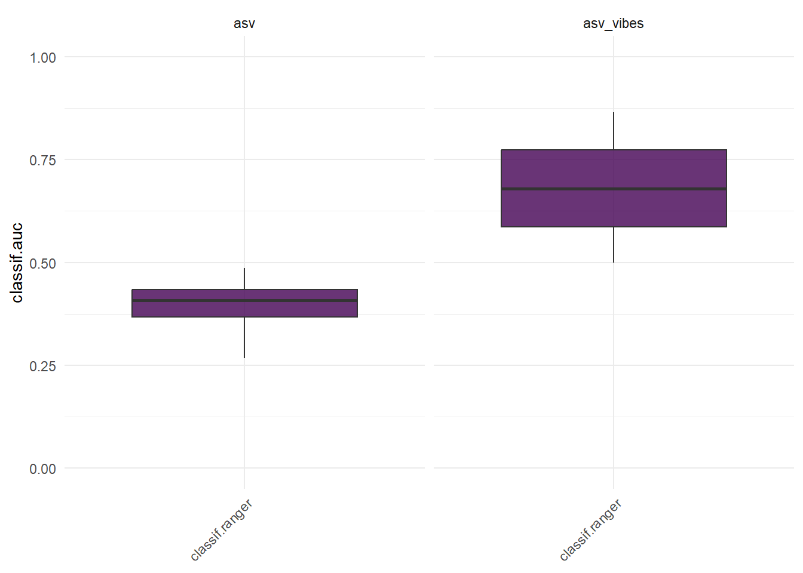

# VIBES Use Case

This code demonstrates a workflow to take advange of `VIBES` funcionality to go further in our microbiome analysis. `VIBES` output will be used for a Machine Learning classification task, in this case to predict the response to treatment. We used  PRJNA302078 included in `VIBES` to run the analysis. The downstream analysis based on ML will be performed with [mlr3](https://mlr3.mlr-org.com/) package. In summary, the code processes microbiome data, applies dimensionality reduction, and performs classification using the `classif.ranger` learner. It also includes benchmarking and visualization of classification performance.

``` r
require(VIBES)

require(ggplot2)
require(PCAtools)
require(phyloseq)
require(dplyr)
require(microbiome)

require(mlr3)
require(mlr3learners)
require(mlr3benchmark)
require(mlr3viz)
```

## Data

- The microbiome data is obtained from the `PRJNA302078` dataset.
- The code performs preprocessing on the data, focusing on the taxonomic rank _Species_.
- In order to predict treatment response based on pre-treatment data, we format the sample_data and keep only those samples at baseline.

``` r
# get data and preprocess
data("PRJNA302078")
pseq = tax_glom(PRJNA302078, taxrank = "Species")
pseq@sam_data$visits = as.numeric(sapply(strsplit(pseq@sam_data$sample_alias, "D"), "[", 2))
pseq = subset_samples(pseq, visits==0)
```


## Data Transformation

- The code uses Principal Component Analysis (PCA) to reduce the dimensionality of the microbiome data.
- We used `VIBES` to extract the probabilities of belonging to each cluster. These variables will be used later as predictive variables.

``` r
# Calculate VIBES
vibes <- get_VIBES(object = pseq, column = 7)
otus <- t(vibes@otu_table@.Data)

# otus data
otus_d <- data.frame(
  microbiome::transform(otus, 'clr'),
  status = vibes@sam_data$status)

# get pca
pca <- PCAtools::pca(mat = otus_d %>% select(-c(status)) %>% t())
otus_pca <- pca$rotated[, 1:3] %>% mutate(status = as.factor(otus_d$status))

# vibes data 
vibes_d <- data.frame(
  VCS.I = vibes@sam_data$VCS.I,
  VCS.I = vibes@sam_data$VCS.II,
  VCS.I = vibes@sam_data$VCS.III,
  VCS.I = vibes@sam_data$VCS.IV,
  status = vibes@sam_data$status
)

# otus + vibes
otus_vibes <- data.frame(
  otus_pca,
  vibes_d %>% select(-c(status))
)
```


## Machine Learning prediction

- Two classification tasks are defined:
  - `otus_task` uses PCA-transformed microbiome data to predict the _status_ variable with a positive class of _Cured_.
  - `otus_vibes_task` combines the PCA-transformed microbiome data with `VIBES` features to predict the _status_ variable with a positive class of _Cured_.
- The code uses the `classif.ranger` learner for classification tasks, configured to predict probabilities.
- Cross-validation with 4 folds due to limited sample size is employed as the outer resampling strategy.
- It runs the benchmark, evaluating the classification performance of the learner.
- The results are visualized using the area under the curve (AUC) measure.

``` r
# Machine Learning
otus_task <- TaskClassif$new(id = "asv",
                        backend = otus_pca,
                        target = "status",
                        positive = "Cured")

otus_vibes_task <- TaskClassif$new(id = "asv_vibes",
                             backend = otus_vibes,
                             target = "status",
                             positive = "Cured")

tasks <- list(otus_task, otus_vibes_task)

# Make learner
learner <- lrn("classif.ranger", predict_type = "prob")

# outer resampling
set.seed(12345)
outer <- rsmp("cv", folds = 4)

# Run benchmark
design = benchmark_grid(tasks, learner, outer)
bmr = benchmark(design)

# Plotting
autoplot(bmr, measure = msr("classif.auc")) + ylim(c(0,1))
```



We can see how the inclusion of VIBES features outperform the prediction task.